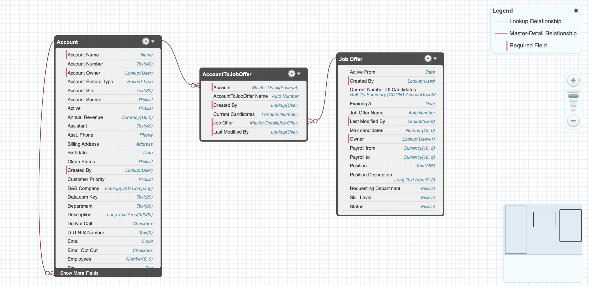

## Table of contents
* [General info](#general-info)
* [Technologies](#technologies)
* [Setup](#setup)

## General info
The aim of the project is to learn about Salesforce technology and better understand the possibilities offered by the platform. The repository consists of code snippets. In the first step of the project, I created a data model around which I built business rules such as: 
* preventing account deletion (Person Account - Candidate)
* checking candidate skill level
* preventing from assigning no more than JobOffer.Max candidates

The project is not finished yet. I am currently preparing myself to write a REST API. Further work on the project requires knowledge of the following technologies and tools:
* HTTP
* REST API
* JSON
* Postman

Next steps related to the project:
* Create REST service methods:GET, POST, PUT, DELETE, PATCH.

sObjectSchema.jpg
	
## Technologies
Project is created with:
* Apex
* Apex Triggers
* SOQL
* Salesforce
* unit tests
